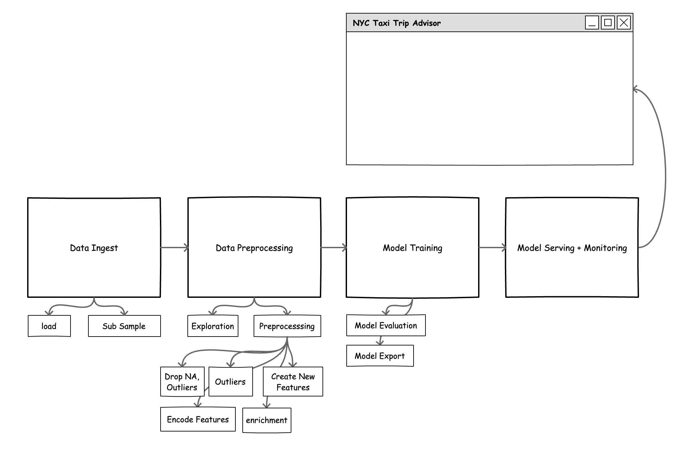

# CML Covid Tracker 

This repo demonstrate steps in examples on how production ML pipelines can be orchestrated using Cloudera Tools. 

- Track the trajectory of Covid Confirmed Cases 
- Explore curve fitting approaches for modelling trend
- Explore recent trend as signal for decision making

## Architecture and Components

- Data [John Hopkins Data](https://www1.nyc.gov/site/tlc/about/tlc-trip-record-data.page)
-  

## TODOs

Initial high level list of tasks: 

- [ ] Data exploration: Explore interesting data insights, data transformation tasks etc 
- [ ] Model Training: Explore a set of models, automated hyperparameter search, distributed training, model evaluation etc
- [ ] Model Serving: Promoting good models to production, serving predictions over an api enddpoint 
- [ ] Front end: User interface for exploring predictions.